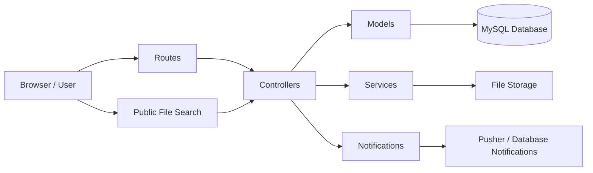

# FileTrack Office Portal

**FileTrack Office Portal** is a Laravel 12 web application for managing and tracking government departmental files throughout their lifecycle.

The system allows authorized users to **create files, assign ownership, transfer files between departments or users, monitor file movements, receive notifications, and search for file information publicly**.

It is designed for government offices and organizations that need a reliable and transparent way to track physical or digital files and maintain a complete history of where each file has been.

---

## 📌 Overview

FileTrack provides a centralized system for managing departmental files from creation to completion.

The system allows users to:

* Create and register new files.
* Assign files to departments and users.
* Transfer files between departments or users.
* Track every movement of a file.
* View the complete history of a file through a timeline.
* Receive notifications when files are transferred or updated.
* Search for files through a public lookup page.
* Manage users and departments according to their roles.
* Allow administrators to impersonate users when support is required.
* Require newly created users to change their password during their first login.

The main goal is to provide **accountability, visibility, and efficient file movement within an organization**.

---

# 🚀 Key Features

## 1. File Management

Users can create and manage departmental files.

Each file can contain:

* A unique manually entered file number.
* File title or subject.
* Department ownership.
* Current file holder.
* File status.
* Optional attachments.
* Creation and update information.

File numbers are manually entered but must remain **unique throughout the system**.

---

## 2. File Transfers

Files can be transferred between authorized users or departments.

A transfer records information such as:

* Previous holder.
* New holder.
* Previous department.
* New department.
* Transfer date and time.
* User responsible for the transfer.
* Transfer notes or comments.

This allows administrators to determine **who currently has a file and where it has previously been**.

---

## 3. File Movement Timeline

Every file has a complete movement history.

The timeline provides a chronological view of file activity, making it easy to determine:

> Where the file started → where it moved → who handled it → where it is currently located.

This is one of the core features of FileTrack and provides an audit trail for every file.

---

## 4. Role-Based Access Control

The system provides different permissions based on user roles.

| Role            | Description                                                                        |
| --------------- | ---------------------------------------------------------------------------------- |
| **Super Admin** | Has system-wide access and manages departments, users, files, and system activity. |
| **Admin**       | Manages users and monitors file activity within their department.                  |
| **User**        | Creates, receives, and transfers files according to the permitted workflow.        |

Access to dashboards, users, departments, and files is controlled according to the user's role.

---

## 5. Department Management

Departments provide the organizational structure for the system.

Administrators can manage:

* Departments.
* Department users.
* Department-owned files.
* Department file activity.
* Transfers involving their department.

Department-level access ensures that administrators can focus on the files relevant to their office.

---

## 6. Public File Search

FileTrack provides a public file lookup feature that does not require authentication.

Members of the public or authorized external users can search for a file using supported file information.

For security reasons, public searches expose only **limited file information**, such as:

* File number.
* File title or subject.
* Current department.
* Current holder.
* Basic file status.

Sensitive internal information is not exposed through the public search.

---

## 7. Notifications

Users receive notifications when important file activity occurs.

Examples include:

* A file has been transferred to the user.
* A file has been received.
* A file has been updated.
* Other relevant file activity has occurred.

Notifications are stored using Laravel's database notification system and can be retrieved by the application.

---

## 8. User Impersonation

Administrators can impersonate another user when necessary for:

* Troubleshooting.
* Support.
* Testing permissions.
* Investigating user-specific issues.

This allows administrators to reproduce a user's experience without requiring access to the user's password.

---

## 9. First Login Password Change

Newly created accounts can be required to change their password when they first log in.

This improves account security by ensuring that temporary or administrator-created passwords are not permanently used.

---

# 🏗️ System Architecture

FileTrack follows a layered Laravel architecture.



### Main Layers

### Presentation Layer

Responsible for the user interface.

Includes:

* Blade templates.
* Bootstrap 5.3.
* Font Awesome.
* Inter font.
* Vite.
* JavaScript.

### Application Layer

Responsible for application logic and request handling.

Includes:

* Controllers.
* Middleware.
* Services.
* Authentication.
* Authorization.
* File transfer logic.
* Dashboard logic.
* Notification handling.

### Data Layer

Responsible for storing application data.

Uses MySQL to store:

* Users.
* Departments.
* Files.
* File movements.
* Transfers.
* Notifications.
* Other system records.

### Storage Layer

Laravel storage is used for files and attachments.

* **Private storage:** File attachments and sensitive documents.
* **Public storage:** Profile photos and other files intended for public access.

### Notification Layer

Notifications use Laravel's database notification system.

Where real-time broadcasting is enabled, Pusher can also be used for live notifications.

---

# 📁 Project Structure

The main application directories are organized as follows:

```text
file-tracking-system/
│
├── app/
│   ├── Http/
│   │   ├── Controllers/
│   │   └── Middleware/
│   │
│   ├── Models/
│   └── Services/
│
├── database/
│   ├── migrations/
│   ├── seeders/
│   └── factories/
│
├── resources/
│   └── views/
│       ├── dashboards/
│       ├── files/
│       ├── admin/
│       └── auth/
│
├── routes/
│   └── web.php
│
├── storage/
│
├── public/
│
├── tests/
│
├── .env.example
├── composer.json
├── package.json
└── vite.config.js
```

### Important Directories

| Directory              | Purpose                                         |
| ---------------------- | ----------------------------------------------- |
| `app/Http/Controllers` | Handles HTTP requests and application workflows |
| `app/Models`           | Contains Eloquent database models               |
| `app/Services`         | Contains reusable business logic                |
| `database/migrations`  | Defines the database structure                  |
| `database/seeders`     | Creates initial or test data                    |
| `resources/views`      | Contains Blade templates                        |
| `routes/web.php`       | Defines application routes                      |
| `storage`              | Stores uploaded and generated files             |
| `tests`                | Contains automated tests                        |

---

# 🛠️ Technology Stack

## Backend

* PHP 8.2+
* Laravel 12
* Laravel Eloquent ORM
* Laravel Authentication & Middleware

## Frontend

* Blade Templates
* Bootstrap 5.3
* Font Awesome 6.5
* Inter Font
* Vite
* JavaScript

## Database

* MySQL 8+

## Storage

* Laravel Filesystem
* Private disk for sensitive attachments
* Public disk for profile photos

## Notifications

* Laravel Database Notifications
* Pusher for real-time notification support

## Testing

* Pest
* Laravel Testing Framework

## Development Tools

* Composer
* Node.js
* npm
* Git

---

# 💻 Requirements

Before installing FileTrack, make sure the following software is installed:

* PHP **8.2 or newer**
* Composer
* Node.js
* npm
* MySQL **8.0 or newer**
* Git

You can verify the installed versions using:

```bash
php -v
composer -V
node -v
npm -v
mysql --version
git --version
```

---

# 📦 Local Installation

## 1. Clone the Repository

```bash
git clone <repository-url>
cd file-tracking-system
```

---

## 2. Install PHP Dependencies

```bash
composer install
```

---

## 3. Install Frontend Dependencies

```bash
npm install
```

---

## 4. Create the Environment File

### Windows

```powershell
copy .env.example .env
```

### Linux / macOS

```bash
cp .env.example .env
```

---

## 5. Configure the Database

Open the `.env` file and configure your MySQL database:

```env
DB_CONNECTION=mysql
DB_HOST=127.0.0.1
DB_PORT=3306
DB_DATABASE=file_tracking_system
DB_USERNAME=root
DB_PASSWORD=
```

Make sure the database exists before running the migrations.

For example:

```sql
CREATE DATABASE file_tracking_system;
```

---

## 6. Generate the Application Key

```bash
php artisan key:generate
```

---

## 7. Run Database Migrations

```bash
php artisan migrate
```

If the project contains database seeders, you can also run:

```bash
php artisan db:seed
```

Or:

```bash
php artisan migrate --seed
```

---

## 8. Create the Storage Link

Run:

```bash
php artisan storage:link
```

This creates the symbolic link required for publicly accessible Laravel storage files.

---

## 9. Build Frontend Assets

For development:

```bash
npm run dev
```

For production:

```bash
npm run build
```

---

## 10. Start the Laravel Application

You can start the application using:

```bash
php artisan serve
```

The application will normally be available at:

```text
http://127.0.0.1:8000
```

If the project is configured with Laravel's development script, you can also use:

```bash
composer run dev
```

---

# 🧪 Running Tests

The project uses Pest/Laravel's testing tools.

Run the complete test suite with:

```bash
php artisan test
```

You can also run Pest directly if it is configured in the project:

```bash
./vendor/bin/pest
```

---

# 🔐 Security Considerations

FileTrack is designed to protect internal file information through role-based access and controlled file visibility.

Important security features include:

* Role-based authorization.
* Department-level access control.
* Protected file attachments.
* Unique file numbers.
* Authentication for internal operations.
* Limited information on public file searches.
* First-login password changes.
* Administrative impersonation controls.

Sensitive documents should remain on Laravel's **private storage disk** and should not be exposed directly through public URLs.

---

# 🔄 File Lifecycle

A typical file workflow looks like this:

```text
File Created
     ↓
Assigned to Department
     ↓
Assigned to User
     ↓
File Processed
     ↓
Transferred to Another User/Department
     ↓
Movement Recorded
     ↓
New Holder Notified
     ↓
File Continues Through Workflow
     ↓
File Completed / Archived
```

Every transfer contributes to the file's movement history.

---

# 📊 Dashboards

## Super Admin Dashboard

Provides a system-wide overview, including:

* Total files.
* Department activity.
* User activity.
* File transfers.
* System-wide statistics.
* User and department management.

## Admin Dashboard

Provides department-level information, including:

* Department files.
* Recent transfers.
* Department users.
* File activity.
* Files currently within the department.

## User Dashboard

Provides information relevant to the individual user, including:

* Files currently assigned to the user.
* Files received.
* Recent transfers.
* Notifications.
* File activity.

---

# 🔎 Public File Lookup

The public search system allows users to search for file information without logging into the application.

The public endpoint intentionally returns only information considered appropriate for public access.

Internal information such as private notes, sensitive attachments, or restricted administrative information should not be exposed through this feature.

---

# 📋 File Numbering

File numbers are entered manually when creating a file.

The system enforces uniqueness to prevent two different files from having the same file number.

For example:

```text
FIN/2026/001
HR/2026/015
ADM/2026/034
```

The exact numbering format can be determined by the organization.

---

# 🧹 Troubleshooting

## Application Shows "Too Many Redirects"

Try clearing the application cache:

```bash
php artisan optimize:clear
```

Then clear your browser cookies for the application and log in again.

---

## Database Connection Error

Check the following values in `.env`:

```env
DB_HOST=127.0.0.1
DB_PORT=3306
DB_DATABASE=file_tracking_system
DB_USERNAME=root
DB_PASSWORD=
```

Also make sure MySQL is running and that the database exists.

---

## Uploaded Files Are Not Displaying

Run:

```bash
php artisan storage:link
```

Then verify that the required files exist in the appropriate Laravel storage directory.

---

## Environment Changes Are Not Taking Effect

Run:

```bash
php artisan optimize:clear
```

Then restart the development server.

---

# 🔄 Updating From Upstream

If your repository is a fork of another repository, you can add the original repository as an upstream remote.

```bash
git remote add upstream <original-repository-url>
```

Fetch the latest changes:

```bash
git fetch upstream
```

Then merge the latest main branch:

```bash
git merge upstream/main
```

Resolve any merge conflicts before continuing development.

---

# 🗺️ Development Workflow

A typical development workflow is:

```text
1. Pull latest changes
        ↓
2. Install/update dependencies
        ↓
3. Configure .env
        ↓
4. Run migrations
        ↓
5. Start Laravel + Vite
        ↓
6. Develop feature
        ↓
7. Run tests
        ↓
8. Review changes
        ↓
9. Commit changes
        ↓
10. Push changes
```

---

# 📌 Important Notes

* File numbers are manually entered and must be unique.
* File transfers are recorded in the movement history.
* The file timeline provides the complete movement history of a file.
* Public file search exposes only limited information.
* Sensitive attachments should remain on private storage.
* User permissions are controlled through roles and department access.
* Newly created users may be required to change their password during their first login.
* Administrators should use impersonation only when necessary for support or troubleshooting.

---

# 📄 License

Add the project's applicable license information here.

If this is proprietary government software, replace this section with the organization's approved licensing and usage policy.

---

## FileTrack Office Portal

**Government File Tracking and Management System**

Designed to provide **accountability, transparency, and efficient movement of departmental files**.

© 2026 FileTrack Office Portal


